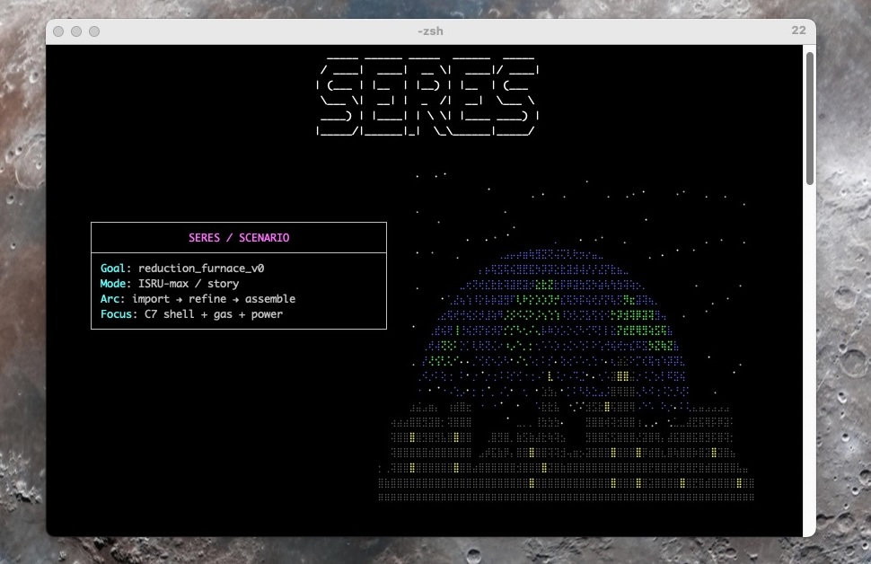

# SERES: Self-Replicating System Modeling

SERES is a knowledge base and simulation system for modeling a self-replicating
industrial ecosystem. It captures the machines, processes, parts, and recipes
needed to build more of itself, then simulates those dependencies over time so
gaps and bottlenecks are explicit. The goal is not a perfect model; it is a
computable dependency graph that can be refined iteratively.



At a high level, SERES has two tightly coupled layers:
- Knowledge base (YAML): the "world model" of items, processes, and recipes.
- Simulator: executes those recipes with time, energy, and inventory accounting.

If you are an AI agent or working the queue, see `AGENTS.md`.

## Quick start (uv)

Prerequisites: Python 3.10+ and `uv` (see https://docs.astral.sh/uv/ for install).

```bash
uv sync
```

Index the knowledge base and generate reports:

```bash
python -m src.cli index
```

Run a minimal simulation:

```bash
python -m src.cli sim init --sim-id demo
python -m src.cli sim import --sim-id demo --item labor_bot_general_v0 --quantity 1 --unit unit
python -m src.cli sim start-process --sim-id demo --process regolith_mining_highlands_v0 --duration 24
python -m src.cli sim advance-time --sim-id demo --hours 24
python -m src.cli sim view-state --sim-id demo
```

## How the project is organized

- `kb/`: YAML knowledge base (items, processes, recipes, BOMs).
- `src/`: indexer, simulator, and CLI (`python -m src.cli`).
- `docs/`: design docs, ADRs, simulation guides, and runbooks.
- `simulations/`: simulation runs and event logs.
- `out/`: generated reports (validation, queue, index, etc.).
- `design/`: research notes and background memos.

## Where to start (human-friendly)

- `docs/project_overview.md`: goals, scope, and modeling philosophy.
- `docs/README.md`: schema references and ADRs.
- `docs/SIMULATION_GUIDE.md`: end-to-end simulation usage.
- `docs/simulation_quick_start.md`: fast path to a new sim.

## How SERES works (in plain English)

SERES is designed to make a self-replication pathway concrete and computable
rather than hypothetical. The knowledge base (KB) is a structured YAML model of
machines, processes, parts, materials, and recipes, plus their inputs, outputs,
durations, and energy requirements. A recipe depends on processes; processes
depend on machines; machines depend on parts; parts depend on materials. These
relationships form a dependency graph the simulator can traverse and execute.

The simulator executes the model over time. It advances time, runs processes,
consumes inventory, and records outcomes. A process can only run if the required
machines and inputs exist; a recipe can only complete if its sub-processes can
run; and total time and energy are tracked explicitly. Every run creates an
audit trail so scenarios are reproducible and explainable.

Because the KB is large and always incomplete, the project relies on indexing
and validation tooling. The indexer builds a map of entities and references,
flags inconsistencies, and surfaces missing pieces as actionable gaps. Those
gaps are not errors to hide; they are the deliberate mechanism that keeps
progress visible and makes closure measurable.

Finally, SERES treats runbooks as scenario artifacts. A runbook is a Markdown
document that combines narrative with executable CLI commands so simulations are
both understandable and repeatable. Each runbook is a test and a design memo: it
demonstrates what is currently possible and highlights what still needs work.
